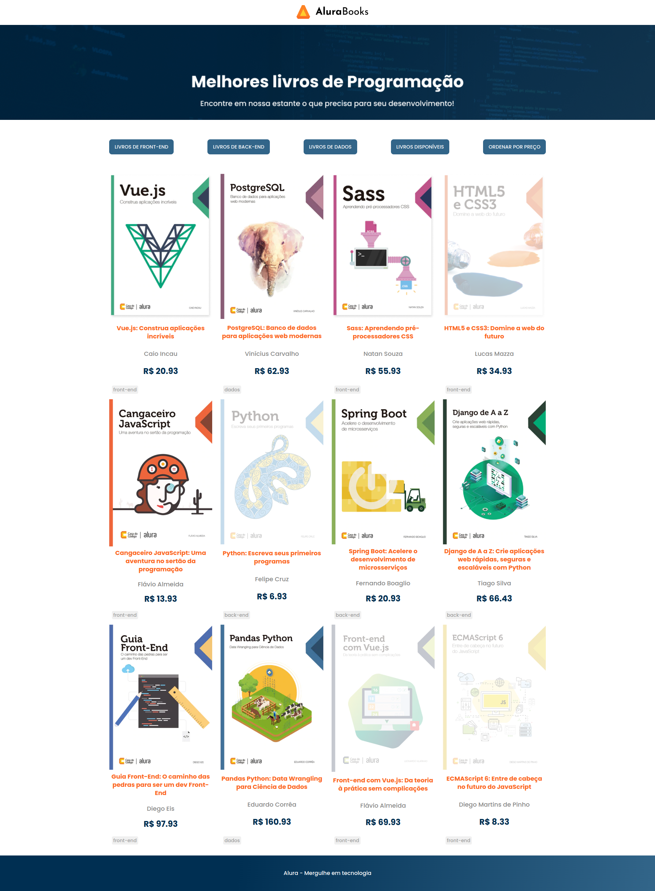

# AluraBooks

Site de uma livraria com livros separados por categorias, livros disponíveis e por ordem de preço.

| :placard: Vitrine.Dev |     |
| -------------  | --- |
| :sparkles: Nome        | **AluraBooks**
| :label: Tecnologias | HTML, CSS e JavaScript
| :rocket: URL         | https://alura-books-9wea.vercel.app/
| :fire: Desafio     | -

## Detalhes do projeto

Projeto usando HTML, CSS e JavaScript com foco na prática dos métodos de array. Nesse projeto aprendi:  
• Como a utilizar os principais métodos de array do JavaScript;  
• Manipular o DOM com base nos métodos de array;  
• Como aplicar ordenação e filtros em meus projetos JavaScript;  

## Screenshot

  </img>

